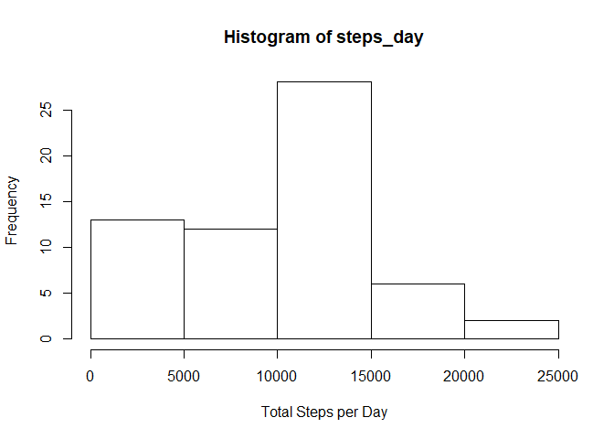
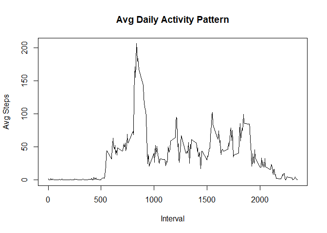
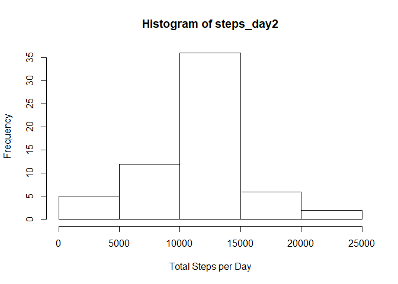
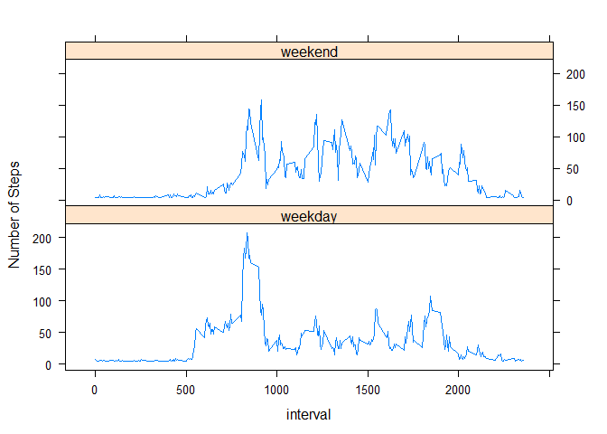

## Loading and preprocessing the data

```r
zipped <- "~/Data Science Learning/Coursera/Reproducible Research/gitFiles/activity.zip"
unzip(zipped)
activity <- read.csv("activity.csv")
activity$date <- as.Date(activity$date)
```

## What is mean total number of steps taken per day?

```r
steps_day <- tapply(activity$steps, activity$date, sum, na.rm=TRUE)
hist(steps_day, xlab="Total Steps per Day")
```

<!-- -->

What is the mean?

```r
mean(steps_day)
```

```
## [1] 9354.23
```
What is the median?

```r
median(steps_day)
```

```
## [1] 10395
```

## What is the average daily activity pattern?

```r
steps <- tapply(activity$steps,activity$interval,mean, na.rm=TRUE)
plot(names(steps),steps,xlab="Interval",ylab="Avg Steps",main="Avg Daily Activity Pattern",type="l")
```

<!-- -->

Of the 288 intervals, which five minute interval has the max average steps?

```r
max(steps)
```

```
## [1] 206.1698
```

```r
which.max(steps)
```

```
## 835 
## 104
```

```r
steps[104]
```

```
##      835 
## 206.1698
```
The interval that represents 8:35 AM to 8:40 has the max average steps.

## Imputing missing values
Total number of missing values in the dataset

```r
sum(is.na(activity$steps))
```

```
## [1] 2304
```
All misisng values will be replaced by the mean of the steps data

```r
library(Hmisc)
```

```
## Loading required package: lattice
```

```
## Loading required package: survival
```

```
## Loading required package: Formula
```

```
## Loading required package: ggplot2
```

```
## 
## Attaching package: 'Hmisc'
```

```
## The following objects are masked from 'package:base':
## 
##     format.pval, units
```

```r
impute <- impute(activity$steps,mean)
```
A new dataset is created with all missing data filled in

```r
activity2 = activity
activity2$steps <- impute
```
Make a histogram of the total number of steps taken each day

```r
steps_day2 <- tapply(activity2$steps, activity2$date, sum)
hist(steps_day2, xlab="Total Steps per Day")
```

<!-- -->

```r
m <- mean(steps_day2)
mid <- median(steps_day2)
```
The mean of the dataset is 1.0766189\times 10^{4}.
The median of the dataset is 1.0766189\times 10^{4}.

You will notice that with imputed missing values, the frequency of 0 - 5000 steps per day has decreased.  The other frequencies are relatively constant.

This data set had about 13% of it's values missing.  Imputing the missing values did not alter the histogram very much; the mean and median are very similar to the original dataset.

## Are there differences in activity patterns between weekdays and weekends?

```r
wd <- weekdays(activity2$date)
wknd <- wd %in% c("Saturday", "Sunday")
activity2$day <- factor(wknd, labels = c("weekday", "weekend"))
# A panel plot containing the average number of steps taken each interval comparing weekdays and weekends.
avgs <- aggregate(steps~interval+day, data=activity2, mean)
xyplot(steps~interval|day, avgs, type="l", layout=c(1,2), ylab = "Number of Steps")
```

<!-- -->
